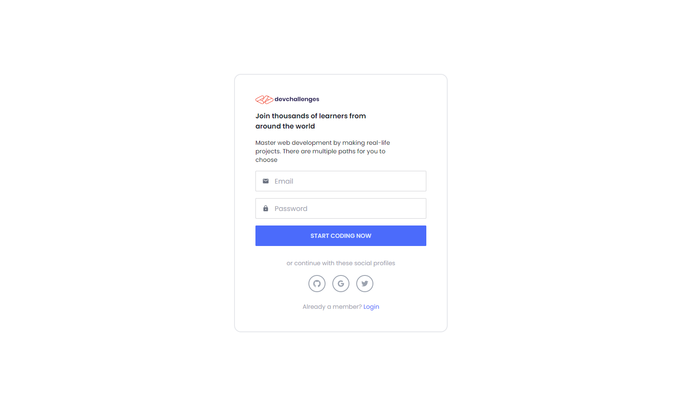

<!-- Please update value in the {}  -->

<h1 align="center">Authentication</h1>

<div align="center">
   Solution for a challenge from  <a href="http://devchallenges.io" target="_blank">Devchallenges.io</a>.
</div>

<div align="center">
  <h3>
    <a href="https://{your-demo-link.your-domain}">
      Demo
    </a>
    <span> | </span>
    <a href="https://{your-url-to-the-solution}">
      Solution
    </a>
    <span> | </span>
    <a href="https://devchallenges.io/challenges/N1fvBjQfhlkctmwj1tnw">
      Challenge
    </a>
  </h3>
</div>

<!-- TABLE OF CONTENTS -->

## Table of Contents

- [Table of Contents](#table-of-contents)
- [Overview](#overview)
  - [Built With](#built-with)
- [Features](#features)
- [How To Use](#how-to-use)
- [Acknowledgements](#acknowledgements)
- [Contact](#contact)

<!-- OVERVIEW -->

## Overview



Demo deployed at [Vercel](https://image-uploader-rose.vercel.app/)

### Built With

<!-- This section should list any major frameworks that you built your project using. Here are a few examples.-->

- [React](https://reactjs.org/)
- [Next.js](https://nextjs.org/)
- [Vue.js](https://vuejs.org/)
- [Tailwind](https://tailwindcss.com/)
- [Upload.IO](https://upload.io/)
- [Firebase](https://firebase.google.com/)

## Features

<!-- List the features of your application or follow the template. Don't share the figma file here :) -->

This application/site was created as a submission to a [DevChallenges](https://devchallenges.io/challenges) challenge. The [challenge](https://devchallenges.io/challenges/N1fvBjQfhlkctmwj1tnw) was to build an application to complete the given user storie.

Challenge: Create an Authentication app. Use any front-end libraries of your choice. Create your API. Don’t look at the existing solution. Fulfill user stories below:

- User story: I can register a new account
- User story: I can log in
- User story: I can log in or register with at least one of the following services: - Google, Facebook, Twitter or Github
- User story: I can sign out
- User story: I can see my profile details
- User story: I can edit my details including: photo, name, bio, phone, email and - password
- User story: I can upload a new photo or provide an image URL

## How To Use

<!-- Example: -->

To clone and run this application, you'll need [Git](https://git-scm.com) and [Node.js](https://nodejs.org/en/download/) (which comes with [npm](http://npmjs.com)) installed on your computer. From your command line:

```bash
# Clone this repository
$ git clone https://github.com/your-user-name/your-project-name

# Install dependencies
$ npm install

# Run the app
$ npm start
```

## Acknowledgements

<!-- This section should list any articles or add-ons/plugins that helps you to complete the project. This is optional but it will help you in the future. For example -->

- [Image uploading API](https://upload.io/)

## Contact

- Website [emilohlund.dev](https://emilohlund.dev)
- GitHub [@emilohlund-git](https://github.com/emilohlund-git)
